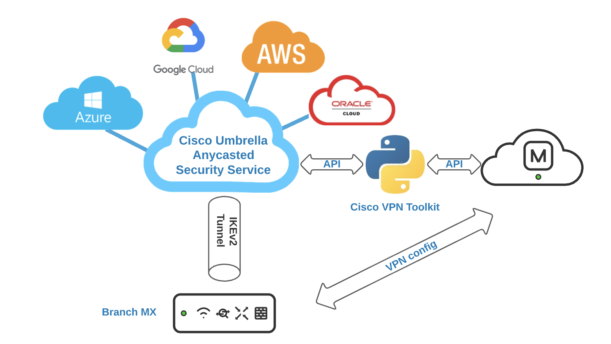
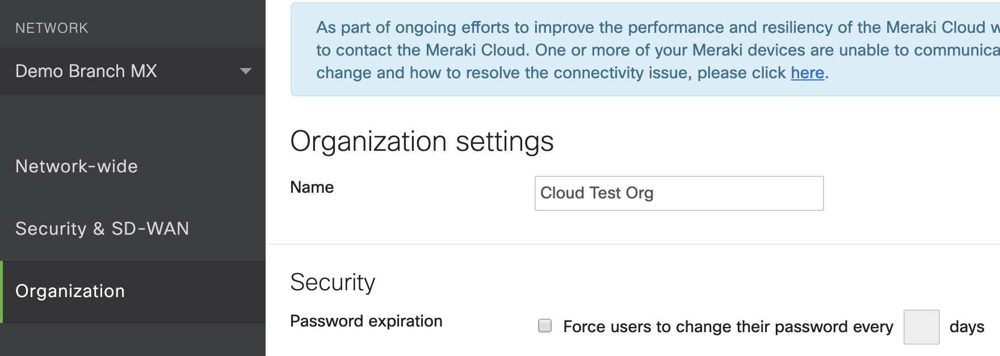
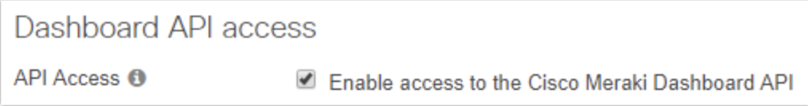
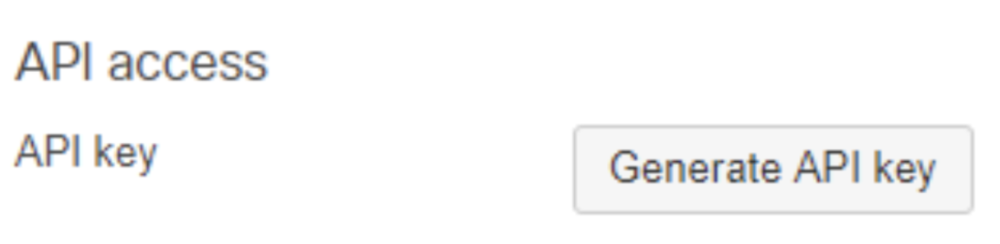
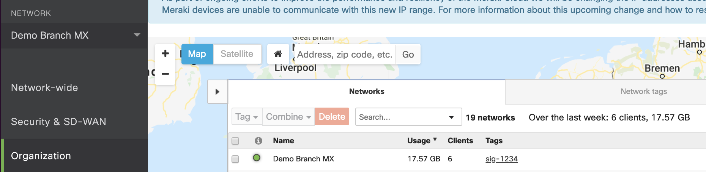
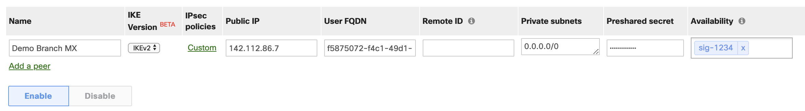

# Overview

This toolkit enables Meraki and Umbrella customers to streamline always on connectivity from a Cisco Meraki Branch site to Cisco Umbrella SIG. Extending secure and automated connectivity to the Umbrella Cloud Security Service. 

# Architecture

# Deployment Steps 

1) Obtain Cisco Meraki API Key and Org Name

    a) The API Key and Org Name will be needed for the script to configure your Meraki device. 

    b) To view your Organization name navigate to Organization > Settings, the name will be displayed at the top. (As seen below)
    
    
    
    c) For access to the API, first enable the API for your organization. 

    d) Navigate to Organization > Settings > Dashboard API access 

    e) Enable the API 
    
    
    
    f) Navigate to the my profile page and generate an API key 
    
    

      Note: The API key is associated with a Dashboard administrator account.   
      
2) Obtain Umbrella Management API Key and Secret 

    a) Download the Mgmt API keys from Umbrella Dashboard. 

    b) Login to Umbrella Dashboard, chose the Org

    c) Navigate to Admin->API Keys menu on Left hand side. 

    d) Once there click on ‘Umbrella Management’. You may need to refresh the keys to get a new set. 

    e) If you don’t find ‘Umbrella Management’ then click on ‘Create’ to create one.
    
      Note: You may follow the directions - https://docs.umbrella.com/umbrella-api/reference#rateauthentication-and-key-management-for-the-umbrella-api
      
3) Download Meraki-Tunnel.py file and enter the Meraki API key and Org name along with the Umbrella Org ID and Mangagement API information under the Umbrella and Meraki classes. 
      
Note: The toolkit also contains a firmware validation checker. One of the requirements for the solution is that the branch MX must be on firmware 15 or greater. This is due to the fact that connectivity to Umbrella SIG requires IKEv2 which is only supported in version 15 firmware. Checks have been placed in the script to ensure sites are on the appropriate firmware.

# Cisco Meraki Workflow 

Initially, there will be no tagged Meraki networks so the script will sleep and perform the same GET to obtain any networks with the relevant tag. In order to deploy a new branch, the user would navigate to Organization > Overview and select the checkbox next to the network that you wish to connect. 

Once the network is tagged appropriately, connectivity is then automatically established. A customer VPN tunnel in the Umbrella dashboard is created with a matching network name to that of the Meraki branch. Site1 will be named Site1 in both the Umbrella and Meraki dashboards. Additionally, a site to site VPN will appear on the site to site VPN page. (As seen below)

The script picks the closest datacenter based on the the closest geographic distance from the public IP. This does not solve the use case for SD WAN, however SD WAN to Umbrella is in the Meraki/Umbrella roadmap. 

Note: The script also assumes VPN is already turned on for the specific MX. For the tunnel to come up, interesting traffic needs to be generated.

To troubleshoot what policy you are hitting, use this debugger link:

http://policy-debug.checkumbrella.com/

# Additional References 

https://documentation.meraki.com/zGeneral_Administration/Organizations_and_Networks/Organization_Menu/Manage_Tags 

https://documentation.meraki.com/zGeneral_Administration/Support/Contacting_Support
